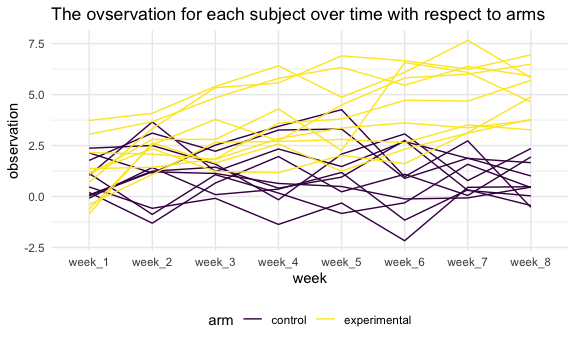

p8015\_hw5\_yw3773
================

``` r
library(tidyverse)
knitr::opts_chunk$set(
  fig.width = 6,
  fig.asp = .6,
  out.width = "90%"
)

theme_set(theme_minimal() + theme(legend.position = "bottom"))

options(
  ggplot2.continuous.colour = "viridis",
  ggplot2.continuous.fill = "viridis"
)

scale_colour_discrete = scale_colour_viridis_d
scale_fill_discrete = scale_fill_viridis_d
```

# Problem 1

``` r
homicide_df = read_csv("homicide-data.csv", na = c("", "unknown")) %>%
  mutate(city_state = str_c(city, state),
         resolution = case_when(
           disposition == "Closed without arrest" ~ "unsolved",
           disposition == "Open/No arrest"        ~ "unsolved",
           disposition == "Closed by arrest"      ~ "solved")) %>%
  relocate(city_state) %>%
  filter(city_state != "TulsaAL")
```

``` r
homicide_df %>%
  group_by(city_state) %>%
  summarize(unsolved = sum(resolution == "unsolved"),
            n = n()) 
```

Let’s focus on Baltimore, MD.

``` r
baltimore_df =
  homicide_df %>%
  filter(city_state == "BaltimoreMD")

baltimore_summary = 
  baltimore_df %>%
  summarize(
    unsolved = sum(resolution == "unsolved"),
    n = n()
  )

baltimore_test = 
  prop.test(x = baltimore_summary %>% pull(unsolved),
          n = baltimore_summary %>% pull(n)) 

baltimore_test %>%
  broom::tidy()
```

Let’s try to iterate across cities!

First off, write a function.

``` r
prop_test_function = function(city_df) {
  city_summary =  
    city_df %>%
    summarize(
      unsolved = sum(resolution == "unsolved"),
      n = n()
      )
  city_test = 
    prop.test(x = city_summary %>% pull(unsolved),
              n = city_summary %>% pull(n)) 
  
  return(city_test)
}
```

Now, let’s iterate across all cities.

``` r
results_df = 
  homicide_df %>%
  nest(data = uid:resolution) %>%
  mutate(
    test_results = map(data, prop_test_function),
    tidy_results = map(test_results, broom::tidy)
  ) %>%
  select(city_state, tidy_results) %>%
  unnest(tidy_results) %>%
  select(city_state, estimate, starts_with("conf"))
```

Try to make a plot showing estimates and CI.

``` r
results_df %>%
  mutate(city_state = fct_reorder(city_state, estimate)) %>%
  ggplot(aes(x = city_state, y = estimate)) +
  geom_point() +
  geom_errorbar(aes(ymin = conf.low, ymax = conf.high)) +
  theme(axis.text.x = element_text(angle = 90, vjust = 0.5, hjust = 1))
```


# Problem 2

``` r
# create a data frame and load all the data into the data frame
arm_df = 
  tibble(files = list.files("data")) %>%
  mutate(files_add = str_c("data/", files),
         data = map(str_c("data/", files), read_csv)
         ) 

# creating subject ID and arm variable, tidy the data for making plots.
arm_df = arm_df %>%
  unnest(data) %>%
  select(-files_add) %>%
  mutate(subject_id = substr(files, 1, 6),
         arm = case_when(
           substr(files, 1, 3) == "con" ~ "control",
           substr(files, 1, 3) == "exp" ~ "experimental"
         )) %>%
  select(-files) %>%
  relocate(subject_id, arm) %>%
  pivot_longer(week_1:week_8,
               names_to = "week",
               values_to = "observation")

head(arm_df)
```

    ## # A tibble: 6 × 4
    ##   subject_id arm     week   observation
    ##   <chr>      <chr>   <chr>        <dbl>
    ## 1 con_01     control week_1        0.2 
    ## 2 con_01     control week_2       -1.31
    ## 3 con_01     control week_3        0.66
    ## 4 con_01     control week_4        1.96
    ## 5 con_01     control week_5        0.23
    ## 6 con_01     control week_6        1.09

``` r
# making plots for each subject over time.
arm_df %>%
  ggplot(aes(x = week, y = observation, group = subject_id, color = subject_id)) + geom_line() + 
  labs(title = "The observation for each subject over time")
```


``` r
arm_df %>%
  ggplot(aes(x = week, y = observation, group = subject_id, color = arm)) + geom_line() + 
  labs(title = "The ovservation for each subject over time with respect to arms")
```



I made two plots showing observations on each subject over time. From
the first plot, where each color represents one specific subject. Since
there are so many colors, it’s hard to see any specific pattern here,
and there is no individual subject that is really different from all the
other subjects. We can only observe that some subjects’ observations are
increasing over time.

From the second plot, where each color present one particular arm. We
can see that for the experimental arm, the observation increases over
time. However, for the control arm, the observation is relatively
constant over time.

# Problem 3

``` r
# load the data set
set.seed(10)

iris_with_missing = iris %>% 
  map_df(~replace(.x, sample(1:150, 20), NA)) %>%
  mutate(Species = as.character(Species))
```

``` r
# function for filling the NA values
fill_in_missing = function(vector){
  
  if (is.numeric(vector)){
    vector[is.na(vector)] = mean(vector, na.rm = TRUE)
    return(round(vector, 2))
  }
  
  if (is.character(vector)){
    vector[is.na(vector)] = "virginica"
    return(vector)
  }
}

# map the function to the original data set to fill all missing values.
iris_with_missing = as.data.frame(map(iris_with_missing, fill_in_missing))
head(iris_with_missing, 10)
```

    ##    Sepal.Length Sepal.Width Petal.Length Petal.Width Species
    ## 1          5.10         3.5         1.40        0.20  setosa
    ## 2          4.90         3.0         1.40        0.20  setosa
    ## 3          4.70         3.2         1.30        0.20  setosa
    ## 4          4.60         3.1         1.50        1.19  setosa
    ## 5          5.00         3.6         1.40        0.20  setosa
    ## 6          5.40         3.9         1.70        0.40  setosa
    ## 7          5.82         3.4         1.40        0.30  setosa
    ## 8          5.00         3.4         1.50        0.20  setosa
    ## 9          4.40         2.9         1.40        0.20  setosa
    ## 10         4.90         3.1         3.77        0.10  setosa
